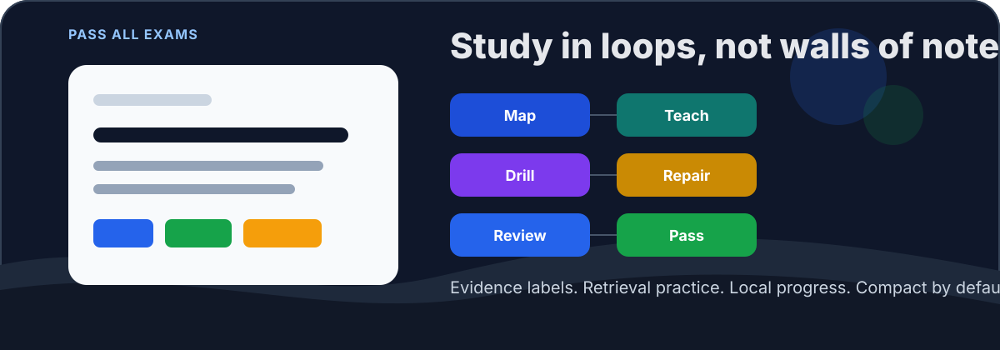

<p align="right">
  <a href="./README.md">EN</a> | <strong>简体中文</strong>
</p>

<p align="center">
  
</p>

<h1 align="center">Pass all exams</h1>

<p align="center">
  <em>期末周了，还没复习？不用慌张，现在是 AI 时代，用 skill 来让你的复习效率翻倍。</em>
</p>

<p align="center">
  <strong>面向 Codex、OpenClaw、OpenCode 的证据化考试复习 Skill。</strong>
</p>

<p align="center">
  把课堂笔记、考纲、往年题和老师重点整理成一套可执行的复习流程：
  先判断会考什么，再逐点讲清、立刻检索、修正错题、安排复盘。
</p>

<p align="center">
  <a href="https://github.com/SolarAscent/pass_all_exams/releases/tag/v0.1.0"></a>
  <a href="./LICENSE"></a>
  
  
  
  
</p>

<br/>

## 这个项目解决什么问题

Pass All Exams 不是“让 AI 帮你生成一份超长复习资料”。它更像一个考前复习教练：每次只处理一个高价值考点，讲完马上测，错了立刻定位原因，再把需要回看的内容排进复盘队列。

默认流程很小，也因此更稳：

```text
一门课 -> 一个高价值考点 -> 一段短讲解 -> 一道检索题 -> 一次修正或一张复盘卡
```

这个项目保留了 `cram-engine` 中最有效的部分：分阶段推进、控制认知负荷、主动回忆、错题补漏。在此基础上，它增加了资料依据标注、机器可读进度、间隔复习卡、理工/编程/语言类课程支持，以及更省 token 的默认模式。

## 如果你还不了解 Agent Skill

Pass All Exams 运行在支持 `SKILL.md` 的智能体工具里。简单说，Skill 就是一份可被智能体读取的流程说明，能让它在某个具体任务上表现得更稳定、更专业。

你不需要理解这些工具的内部实现，但需要先安装一个兼容的智能体。

| 工具 | 简单说明 | 官网 |
|---|---|---|
| Codex | OpenAI 的编程智能体，可在 ChatGPT 和本地开发流程中使用。 | [openai.com/codex](https://openai.com/codex/) |
| Claude Code | Anthropic 的命令行编程智能体。本项目的复习流程可迁移，但安装脚本目前主要适配 Codex、OpenClaw、OpenCode。 | [Claude Code Docs](https://code.claude.com/docs/en/overview) |
| OpenClaw | 支持 Skill 机制的开放智能体平台，Skill 以 `SKILL.md` 为核心。 | [docs.openclaw.ai](https://docs.openclaw.ai/) |
| OpenCode | 终端里的编程智能体，支持从项目目录或全局目录加载 Agent Skills。 | [opencode.ai/docs](https://opencode.ai/docs/) |

## 为什么需要它

| 常见复习问题 | Pass All Exams 的处理方式 |
|---|---|
| AI 写了很多内容，但你并不知道自己会不会。 | 每讲完一个知识点，都必须接一次检索练习。 |
| “可能会考”听起来像“老师说会考”。 | 明确区分 `资料依据`、`合理推断`、`待确认`。 |
| 聊天记录越堆越长，后面越来越费 token。 | 进度写入 `state.json`、`errors.jsonl`、`cards.jsonl`，需要时读取摘要。 |
| 很多速成工具只适合文科论述课。 | 增加定量题、编程题、语言题和记忆密集型课程的复习模式。 |
| 错题只是被原话重讲一遍。 | 先判断错因，再换一种讲法，并从新角度重测。 |

## 安装

按你使用的智能体选择安装方式。GitHub 仓库名是 `pass_all_exams`，安装后的 skill 名是 `pass-all-exams`。

### 方式一：从 Git 安装

```bash
git clone https://github.com/SolarAscent/pass_all_exams.git
cd pass_all_exams
```

然后选择你的智能体：

| 智能体 | 命令 |
|---|---|
| Codex | `bash scripts/install.sh codex` |
| OpenClaw | `bash scripts/install.sh openclaw` |
| OpenCode，全局 | `bash scripts/install.sh opencode` |
| OpenCode，仅当前项目 | `bash scripts/install.sh opencode-project` |

### 方式二：手动克隆到指定目录

```bash
# Codex
git clone https://github.com/SolarAscent/pass_all_exams.git ~/.codex/skills/pass-all-exams

# Codex，使用 CODEX_HOME 时
git clone https://github.com/SolarAscent/pass_all_exams.git "$CODEX_HOME/skills/pass-all-exams"

# OpenClaw
git clone https://github.com/SolarAscent/pass_all_exams.git ~/.openclaw/skills/pass-all-exams

# OpenCode 全局
git clone https://github.com/SolarAscent/pass_all_exams.git ~/.config/opencode/skill/pass-all-exams

# OpenCode 当前项目
git clone https://github.com/SolarAscent/pass_all_exams.git .opencode/skill/pass-all-exams
```

### 方式三：下载 `.skill` 包

下载 release 附件：

```text
https://github.com/SolarAscent/pass_all_exams/releases/download/v0.1.0/pass-all-exams.skill
```

如果你的客户端或网页端支持上传 skill 压缩包，可以直接使用这个文件。

## 快速开始

安装后，直接说：

```text
/exam 组织行为学 start
```

也可以一次性把已知信息说清楚：

```text
帮我用 pass-all-exams 复习组织行为学。
考试题型是选择题、简答题和案例分析。
老师强调必考：霍桑实验、期望理论。我会继续粘贴课堂笔记。
```

英文课程同样可以：

```text
Use pass-all-exams to help me review Organizational Behavior.
The exam has multiple choice, short answer, and case analysis.
My must-know topics are Hawthorne studies and expectancy theory.
```

## 复习流程

```text
建档
  收集课程名、考试时间、题型、资料、必考点

拆解
  把资料拆成可考试的小知识点，并标注来源可信度

讲授
  一次只讲一个点：先给具体场景，最多拆成三块，再让你自己总结

检题
  按真实题型练习：选择、案例、计算、代码 trace、简答等

补漏
  判断错因，换讲法，从新角度重测

复盘
  生成当天、次日、三天后、考前一天的检索卡
```

## 证据约束

每次讲解、预测考法或批改答案时，都要把来源状态说清楚：

```text
资料依据:
- 直接来自你的笔记、考纲、老师原话、往年题或粘贴资料。

合理推断:
- 基于课程常识和常见考试方式做出的复习判断。

待确认:
- 需要你再核对老师要求、教材版本或本校考试范围的内容。
```

如果你没有提供任何资料，它可以按通用知识带你复习，但不能假装知道你老师真正会考什么。

## 命令

| 命令 | 作用 |
|---|---|
| `/exam <课程> start` | 创建或刷新课程复习计划。 |
| `/cram <课程> start` | 兼容 cram-style 的使用习惯。 |
| `/exam <课程> resume` | 从保存进度继续。 |
| `/exam <课程> drill` | 根据薄弱点和到期复习卡出题。 |
| `/exam <课程> retry <知识点>` | 对某个薄弱点重讲、重测并更新记录。 |
| `/exam <课程> summary` | 输出考前清单。 |

## 本地状态

课程数据默认保存在本机：

```text
~/.pass-all-exams/courses/<course-slug>/
```

主要文件：

| 文件 | 作用 |
|---|---|
| `course.yaml` | 课程配置：题型、资料、必考点、偏好。 |
| `state.json` | 当前阶段和知识点状态。 |
| `errors.jsonl` | 错题和诊断记录。 |
| `cards.jsonl` | 检索复习卡和到期日期。 |
| `sessions.jsonl` | 可选会话日志。 |

常用脚本：

```bash
python3 scripts/examctl.py init --course "组织行为学"
python3 scripts/examctl.py status --course "组织行为学"
python3 scripts/examctl.py summary --course "组织行为学"
```

记录一个知识点和一次错题：

```bash
python3 scripts/examctl.py record-point \
  --course "组织行为学" \
  --point "期望理论" \
  --level must \
  --status taught \
  --source material

python3 scripts/examctl.py record-error \
  --course "组织行为学" \
  --point "期望理论" \
  --reason confusion \
  --question-type "选择题" \
  --must-know
```

## Token 模式

| 模式 | 适合场景 | 行为 |
|---|---|---|
| `compact` | 大多数考前突击 | 一个知识点、一个例子、一题检索、一次纠错。 |
| `standard` | 正常周复习 | 多一个例子，并关联一个已学知识点。 |
| `deep` | 难课或高风险考试 | 增加推导、边界条件和混合练习。 |

默认使用 `compact`。详细阶段规则放在 `references/`，只有需要时才加载，避免每次都把长提示塞进上下文。

## 适合哪些课

| 课程类型 | 示例 | 特别处理 |
|---|---|---|
| 文史社科 | 法学、政治学、社会学、教育学 | 定义、比较、案例分析踩分框架 |
| 经管类 | 组织行为学、市场营销、会计理论 | 框架、陷阱、场景应用 |
| 定量课 | 高数、统计、经济学方法 | 公式条件、例题、计算错误诊断 |
| 编程课 | 数据结构、数据库、操作系统、Python/C/Java | 代码 trace、bug 修复、复杂度解释 |
| 语言和记忆密集课 | 英语、历史、医学基础 | 填空、回忆卡、对比表 |

## 打包与验证

生成可上传的 `.skill` 包：

```bash
python3 scripts/package_skill.py
```

验证 skill 结构：

```bash
python3 scripts/validate_skill.py
python3 -m py_compile scripts/examctl.py scripts/validate_skill.py scripts/package_skill.py
```

## 仓库结构

```text
pass_all_exams/
├── SKILL.md                    # 智能体读取的入口
├── agents/openai.yaml          # Codex UI 元数据
├── configs/example.yaml        # 示例课程配置
├── references/
│   ├── pipeline.md             # 详细复习流程
│   ├── prompt-patterns.md      # 可复用提示模板
│   ├── platforms.md            # Codex/OpenClaw/OpenCode 安装说明
│   └── comparison.md           # 设计对比说明
├── scripts/
│   ├── examctl.py              # 本地进度管理
│   ├── install.sh              # 跨平台安装脚本
│   ├── package_skill.py        # .skill 打包脚本
│   └── validate_skill.py       # 结构校验脚本
└── docs/hero.svg
```

## 隐私

所有课程数据默认只保存在本机。这个 skill 不需要外部服务、数据库或账号。你的笔记、错题和复习卡会保存在 `~/.pass-all-exams/`，除非你主动移动或分享。

## License

[MIT](LICENSE)
